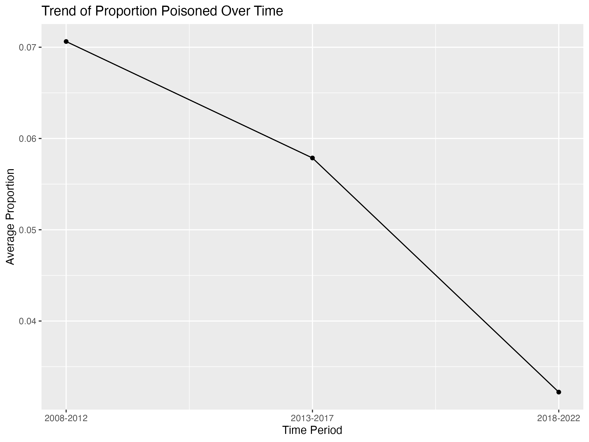
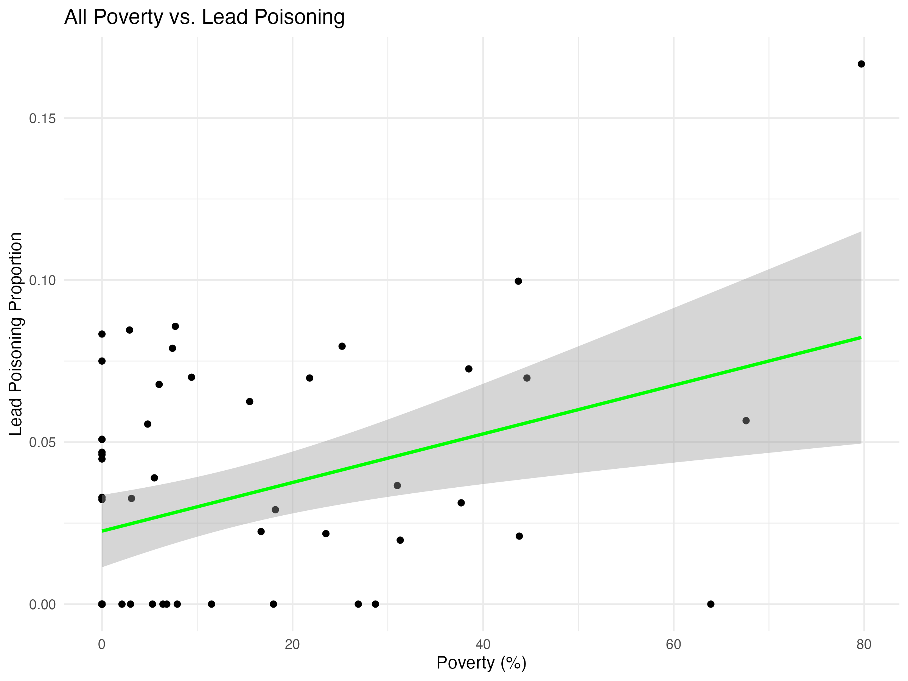
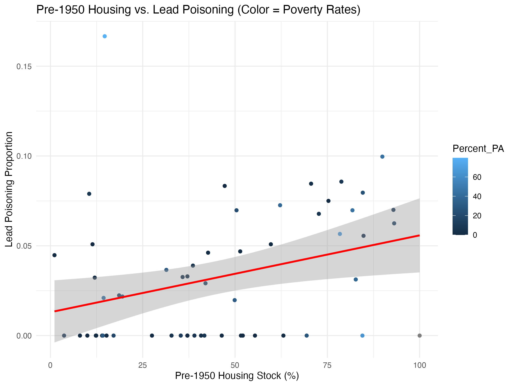
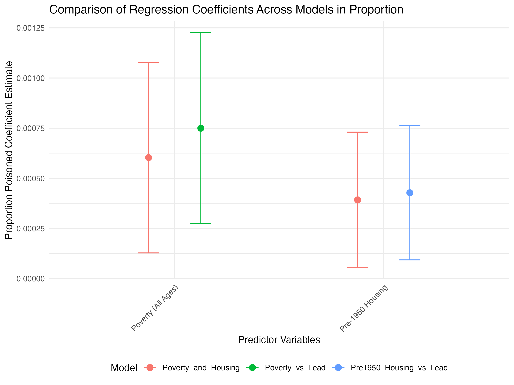
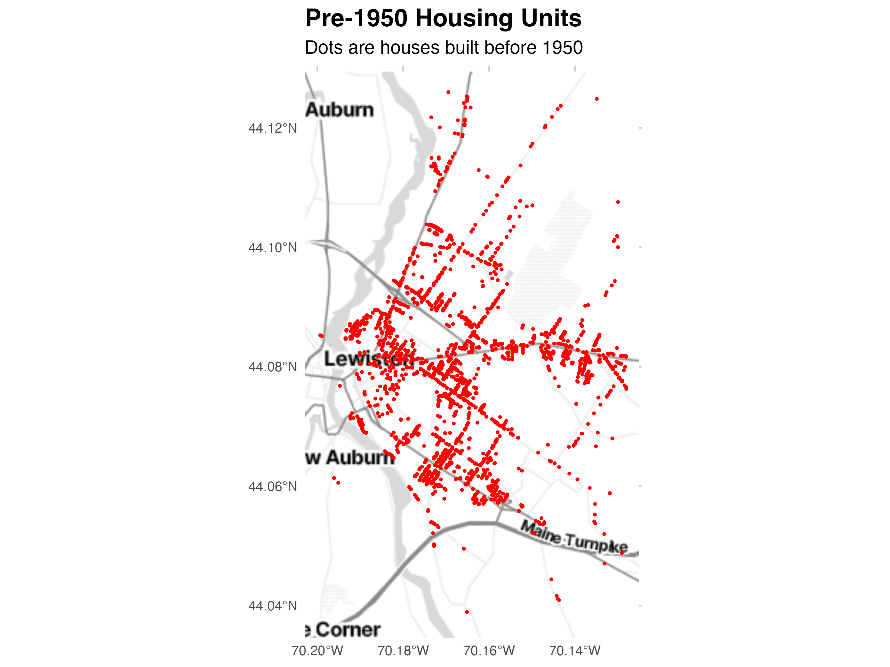
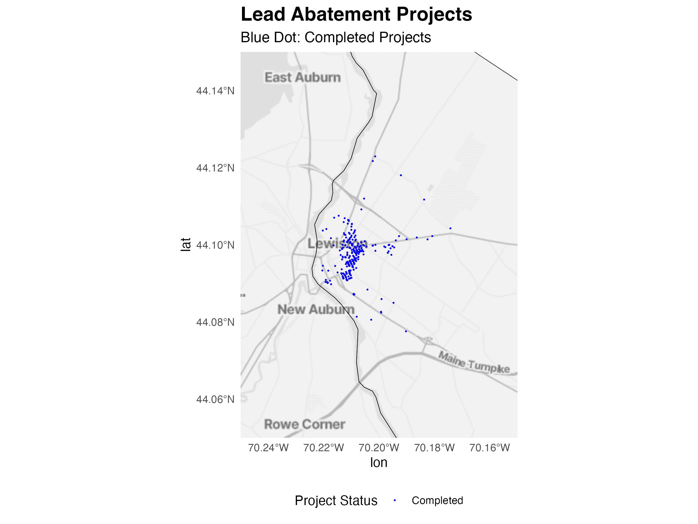
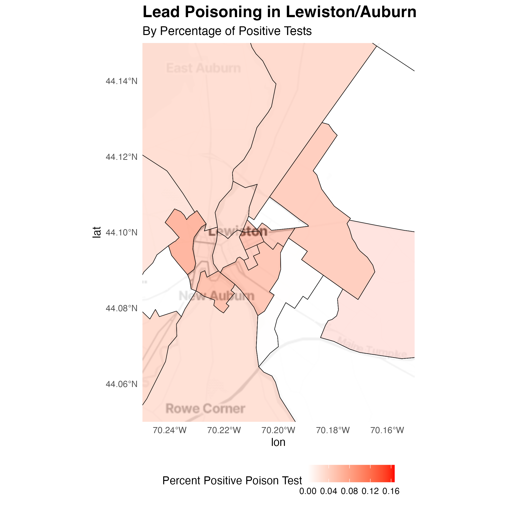
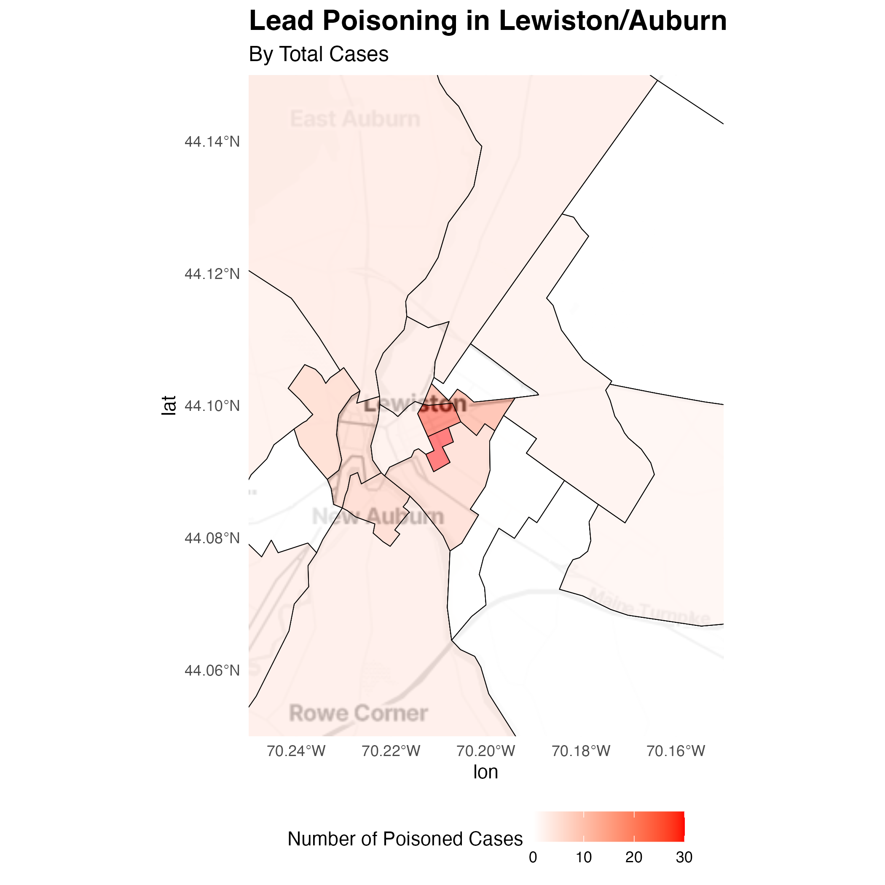

```{r setup, include=FALSE}
knitr::opts_chunk$set(echo = FALSE)
source('housekeeping.R')
```

## Outline of Presentation

- Introduction/Literature
- Data
- Maps
- Regressions
- Cost-benefit
- Limitations
- Recommendations for future plans


## Introduction

- Research Questions:
  -   What areas have received lead abatement? 
  -   Are these areas with the greatest need for abatement?
  -   How effective is the lead abatement program?


## Literature 

- Childhood lead exposure leads to adverse health effects into adolescence (Shadbegian et al., 2019)
  -   In this North Carolina study, children with higher blood lead levels had lower standardized test scores
  -   The magnitude of this effect on test scores persists and is stable between grades 3-8
- Rhode Island experiment found that an increase in lead increased the probability of suspension from school  and the probability of detention (Aizer and Currie, 2017)
- Childhood lead exposure can even lead to personality changes in adulthood, making people less agreeable (Schwaba et al., 2021)


## Data
- Lead Poisoning
  - Lead poisoning and testing figures by region
  - Created proportion variable to measure amount positive
- Risk Factors
  - Poverty and pre-1950 housing data by region
- Abatement projects
  - Tracks abatement projects across time by region
- Housing data
  - Lewiston/Auburn housing data with year built
- Census geometry
  - Census data for geography of tracts in the Lewiston/Auburn area


## Visualization of some data

```{r, echo=FALSE, out.width="90%", fig.align="center"}

```


## Regressions

```{r, echo=FALSE, out.width="90%", fig.align="center"}

```


## Regressions

```{r, echo=FALSE, out.width="90%", fig.align="center"}

```

## Comparisons of Coefficients

```{r, echo=FALSE, out.width="90%", fig.align="center"}

```


## Maps

```{r, echo=FALSE, out.width="90%", fig.align="center"}

```


## Maps

```{r, echo=FALSE, out.width="80%", fig.align="center"}

```


## Maps

```{r, echo=FALSE, out.width="70%", fig.align="center"}

```

## Maps

```{r, echo=FALSE, out.width="80%", fig.align="center"}

```

## Conclusion

- Workflow
- Regression analysis: 
  - poverty vs. lead poisoning
  - Pre-1950 housing vs. lead poisoning
- Map: housing, lead-poisoning
  - Lead abatement projects were focused on areas that had high lead-exposure 


## Costs and Benefits of Lead Abatement 

- Costs
  - High costs associated with physically removing lead from houses or demolishing/building new houses
  - Large proportion of lead abatement cases involved grants (2.7 on average per project in dataset)
  - 58% of households required grants, with each grant being on average $8,203 (Final Narrative Report, 2021) 
- Benefits
  - Can reduce the effects of childhood lead poisoning, which include lower standardized test scores
  - Significant decreases in blood lead levels can reduce crime, increase high school graduation rates, and save billions of dollars (Muennig, 2009)


## Limitations

- Data limitations
  - Incompleteness of Data
  - Estimated Values
  - Self-Selection Bias
- Potential Omitted Variables
- Time Frame Discrepancies

## Recommendations for future plans

- Locations with high levels of lead poisoning cases
- Focus on regions with older housing stock
- Prioritize low-income communities 
- Highly industrialized regions 

Possible new questions can be answered using this dataset
- Which Populations Are Most Affected?
- What Are the Key Drivers of Lead Exposure?
- Where Should Lead Abatement Efforts Be Focused?